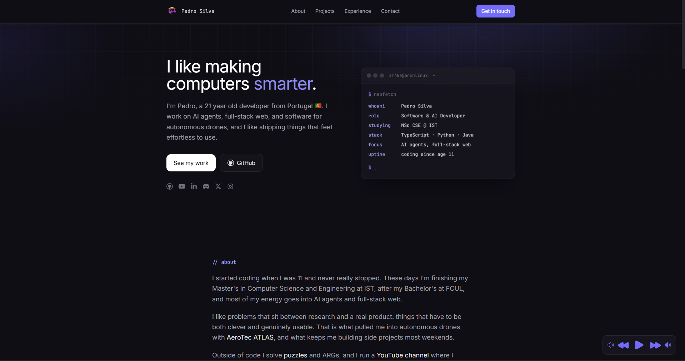

# Portfolio

Personal website of Pedro Silva ([zF4ke](https://github.com/zF4ke)) — live at [portfolio-zf4ke.vercel.app](https://portfolio-zf4ke.vercel.app).

Built with Next.js (pages router), React 18, Tailwind CSS, and TypeScript. Projects are pulled live from the GitHub API at build time and revalidated hourly. Emojis render as [Twemoji](https://github.com/jdecked/twemoji) SVGs for consistent cross-platform appearance.

## Preview



## Development

```bash
npm install
npm run dev    # http://localhost:3000
npm run build  # production build
```

Deployed automatically by Vercel on push to `master`.
